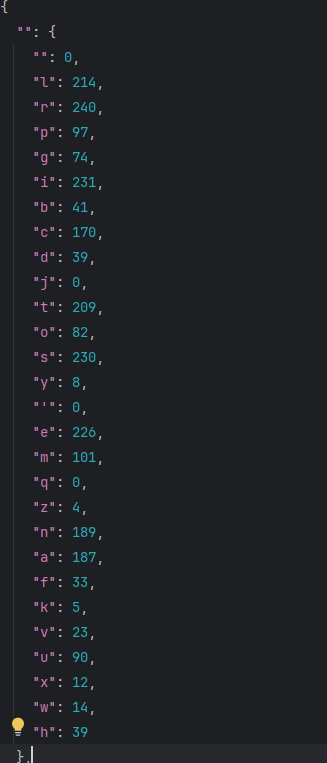
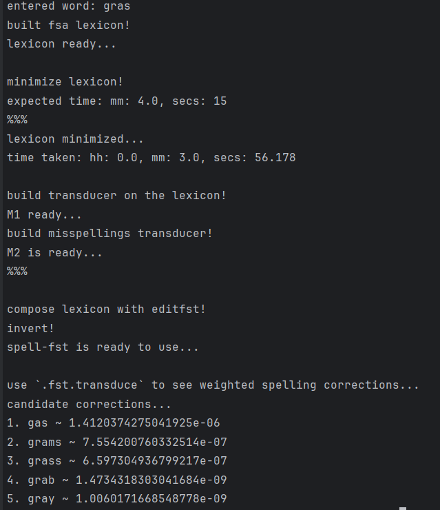

<h1 align="center">Spell-Checker</h1>
<h2 align="center">built on FSTs</h2>

--- 

## Project Description

### <i>Spell-Checker</i>  
├── **data**  
&nbsp;&nbsp;&nbsp;&nbsp;&nbsp;&nbsp;      ├── lexicon.txt **# one word per line, they constitute the lexical FST**  
&nbsp;&nbsp;&nbsp;&nbsp;&nbsp;&nbsp;      ├── spell-errors.json **# generated by compute_weights.py, all spelling errors in spelling-data.txt gotten by Levenshtein alignment**  
&nbsp;&nbsp;&nbsp;&nbsp;&nbsp;&nbsp;      ├── spelling-data.txt **# wordlist based on the WikiEdit corpus**  
├── **images**  
&nbsp;&nbsp;&nbsp;&nbsp;&nbsp;&nbsp;      ├── editfst.png **# FST that allows for insertion/deletion/replacement for all characters in the alphabet**  
&nbsp;&nbsp;&nbsp;&nbsp;&nbsp;&nbsp;      ├── example-lexicon-fsa.png **# Example of the trie FSA (later FST)** 
&nbsp;&nbsp;&nbsp;&nbsp;&nbsp;&nbsp;      ├── example-lexicon-fsa-minimized.png **# After minimization**  
&nbsp;&nbsp;&nbsp;&nbsp;&nbsp;&nbsp;      ├── fsa_subset_lexicon.png **# Extended trie FSA** 
&nbsp;&nbsp;&nbsp;&nbsp;&nbsp;&nbsp;      ├── fsa_subset_lexicon2.png **# Minimized extended version**  
├── **compute_weights.py** # Counts the alignments between two words (their characters) with the minimum edit-distance algorithm. The generated file will be used to generate the weights in the spell-checker.   
├── **fsa.py** # Finite State Automata implementation, builds automaton on a given lexicon of words and minimizes it for optimal/efficient performance.  
├──  **fst.py** # Contains Finite State Transducer class that has methods to turn the trie FSA into a FST, invert any FST, compose any two FST instances and transduce (generate all possible weighted **(given from the alignments)** paths) for an input word.  
├──  **main.ipynb** # Implements the whole pipeline and uses the spell-checker to show the **Top 10** corrections for a given word.  
├──  **main.py** Same as **main.ipynb** but intended for command-line usage  
├──  **README.md** # Current file  
├──  **spell_fst.py** # Implements the FST which encodes all possible **insertions/deletions/replacements** operations and builds the pipeline for the **spell-checker**. It starts by computing the weights for the frequent differences in spelling based on the data in **spelling-data.txt**. Then builds and minimizes a trie FSA of all words in **lexicon.txt**. This trie is going to be one of the FSTs (after conversion) that we will compose. The other FST is the one that produces all up-to one edit distance away words. **Inverting** the **composed FSTs** will result in machine that given a misspelled word, will retrieve all words one edit distance away in our lexicon. Transducing the misspelled word **yields** the suggestions/candidates with their respective weights. Higher the weight, more probable the produced word is (given our data).   

## Example workflow + usage 

1. Compute the weights by running `python compute_weights.py`
You will receive a message containing the number of iterations (epochs) when counts are estimated. The expected output file looks like:

where "" in the outer dictionary indicate insertion and  "" in the inner dictionary indicate deletion. The file contains for each character, how much is being aligned with any other character.

2. Check the corrections for a potential misspelled word by running `python main.py gras` with a required position for input word.  

**N.B.** The limit of corrections is manually set to show the **Top 10** words based on their probabilities. In case less than 10 suggestions occur, all of them are taken. 

**N.B.** This project is part of **Graded assignment: Spell checking with FSTs** in DSA3 course offered annually @UniversityOfTübingen. Although the following implementation has some changes, the main part was preserved, you can find it at [Project Description](https://dsacl3-2022.github.io/p1/).
